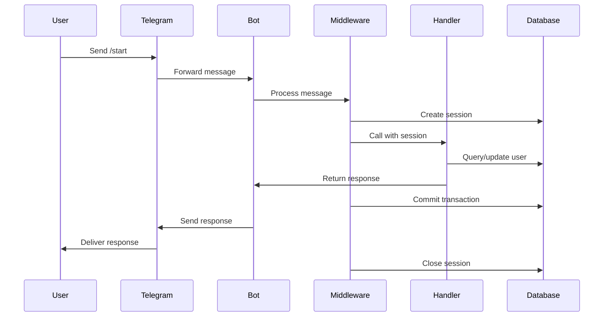

# Bot API Documentation

Commands, handlers, and API interactions for Hello Bot.

## Bot Commands

| Command  | Description               | Response                         | Database Action             |
| -------- | ------------------------- | -------------------------------- | --------------------------- |
| `/start` | Get personalized greeting | `Hello world, <username>`        | Creates/updates user record |
| _other_  | Any other message         | `Send /start to get a greeting!` | None                        |

## Command Details

### `/start` Command

**Handler**: `app/handlers/start.py:start_handler()`

**Purpose**:

- Welcome new users to the bot
- Create or update user record in database
- Provide personalized greeting

**Flow**:

1. Receive `/start` command from user
2. Extract user info from Telegram message
3. Look up existing user by `telegram_id`
4. If user exists → update info, if not → create new user
5. Send personalized greeting with user's display name

**Code Implementation**:

```python
async def start_handler(message: types.Message, session: AsyncSession) -> None:
    """Handle /start command."""
    if not message.from_user:
        await message.answer("Hello world, <b>Unknown</b>", parse_mode=ParseMode.HTML)
        return

    # Get or create user in database
    user = await get_or_create_user(session, message.from_user)

    # Send greeting
    greeting = f"Hello world test deploy 🪏, <b>{user.display_name}</b>"
    await message.answer(greeting, parse_mode=ParseMode.HTML)
```

**Response Format**:

- **HTML formatting** with bold username
- **Display name priority**: `@username` > `first_name last_name` > `User{telegram_id}`
- **Example responses**:
  - `Hello world test deploy 🪏, <b>@john_doe</b>`
  - `Hello world test deploy 🪏, <b>John Smith</b>`
  - `Hello world test deploy 🪏, <b>User123456789</b>`

**Service Layer Architecture**:

The bot now uses a modern Service Layer pattern for business logic separation:

```python
# app/services/user.py
from app.services.base import BaseService

class UserService(BaseService):
    """Service for user-related business logic."""

    async def get_or_create_user(self, telegram_user: types.User) -> User:
        """Get existing user or create new one with caching."""
        # 1. Check cache first (Redis/memory)
        cached_user = await self.get_cached_user(telegram_user.id)
        if cached_user:
            return cached_user

        # 2. Search database for existing user
        stmt = select(User).where(User.telegram_id == telegram_user.id)
        user = (await self.session.execute(stmt)).scalar_one_or_none()

        if user:
            # 3. Update existing user info
            user.username = telegram_user.username
            user.first_name = telegram_user.first_name
            user.last_name = telegram_user.last_name
            user.language_code = telegram_user.language_code
        else:
            # 4. Create new user record
            user = User(
                telegram_id=telegram_user.id,
                username=telegram_user.username,
                first_name=telegram_user.first_name,
                last_name=telegram_user.last_name,
                language_code=telegram_user.language_code,
            )
            self.session.add(user)

        await self.session.commit()

        # 5. Cache the user for future requests
        await self.cache_user(user)

        return user

# Dependency injection in handlers
async def start_handler(message: types.Message, user_service: UserService) -> None:
    user = await user_service.get_or_create_user(message.from_user)
```

### Default Handler

**Handler**: `app/handlers/common.py:default_handler()`

**Purpose**:

- Handle all messages that don't match specific commands
- Guide users to use `/start` command
- Log unknown message attempts

**Flow**:

1. Receive any non-command message
2. Send guidance message
3. Log interaction for monitoring

**Code Implementation**:

```python
async def default_handler(message: types.Message) -> None:
    """Handle all other messages."""
    await message.answer("Send /start to get a greeting!")

    if message.from_user:
        logger.info(
            f"Received unknown message from {message.from_user.username or message.from_user.first_name}"
        )
```

**Response**:

- Fixed text: `"Send /start to get a greeting!"`
- No database interaction
- Logs user interaction

## Handler Registration

**File**: `app/main.py:create_dispatcher()`

```python
def create_dispatcher() -> Dispatcher:
    """Create and configure dispatcher."""
    dp = Dispatcher()

    # Add database middleware (injects session into handlers)
    dp.message.middleware(DatabaseMiddleware())

    # Register handlers (order matters!)
    register_start_handlers(dp)     # /start command
    register_common_handlers(dp)    # Catch-all for other messages

    return dp
```

**Registration Details**:

```python
# Start handler - specific command
dp.message.register(start_handler, Command("start"))

# Default handler - catches everything else
dp.message.register(default_handler)
```

### Current Router Pattern (aiogram 3.0+) ✅

**Modern Implementation (Currently Used)**:

```python
# app/handlers/start.py
from aiogram import Router
from aiogram.filters import Command
from app.services.user import UserService

start_router = Router(name="start")

@start_router.message(Command("start"))
async def start_handler(message: types.Message, user_service: UserService) -> None:
    """Handle /start command using modern Router + Service Layer pattern."""
    if not message.from_user:
        await message.answer("Hello world, <b>Unknown</b>", parse_mode=ParseMode.HTML)
        return

    # Use service layer for business logic
    user = await user_service.get_or_create_user(message.from_user)
    greeting = f"Hello world test deploy 🪏, <b>{user.display_name}</b>"
    await message.answer(greeting, parse_mode=ParseMode.HTML)

# app/handlers/common.py
from aiogram import Router, F

common_router = Router(name="common")

@common_router.message(F.text)
async def default_handler(message: types.Message) -> None:
    """Handle all non-command messages with explicit filter."""
    await message.answer("Send /start to get a greeting!")

# app/main.py
def create_dispatcher() -> Dispatcher:
    """Create dispatcher with modern Router pattern."""
    dp = Dispatcher()

    # Add middleware
    dp.message.middleware(DatabaseMiddleware())

    # Include routers (current implementation)
    dp.include_router(start_router)
    dp.include_router(common_router)

    return dp
```

### Advanced Filters

**Custom Filters for Fine-Grained Control**:

```python
from aiogram.filters import BaseFilter

class UserTypeFilter(BaseFilter):
    """Filter messages by user type."""

    def __init__(self, user_type: str):
        self.user_type = user_type

    async def __call__(self, message: types.Message, session: AsyncSession) -> bool:
        if not message.from_user:
            return False

        user = await get_user(session, message.from_user.id)
        return user and user.user_type == self.user_type

# Usage in Router
@start_router.message(Command("admin"), UserTypeFilter("admin"))
async def admin_handler(message: types.Message, session: AsyncSession) -> None:
    await message.answer("Admin panel access granted")

# Built-in filters combination
@start_router.message(
    Command("start"),
    F.chat.type == "private",  # Only in private chats
    F.from_user.is_bot == False  # Not from bots
)
async def private_start_handler(message: types.Message) -> None:
    await message.answer("Private start command")
```

## Middleware

### Database Middleware

**File**: `app/middlewares/database.py`

**Purpose**:

- Automatically inject database session into every handler
- Handle transaction management (commit/rollback)
- Ensure proper session cleanup

**Implementation**:

```python
class DatabaseMiddleware(BaseMiddleware):
    """Middleware to inject database session into handlers."""

    async def __call__(self, handler, event, data):
        async with AsyncSessionLocal() as session:
            try:
                # Inject session into handler data
                data["session"] = session

                # Call the handler
                result = await handler(event, data)

                # Commit transaction
                await session.commit()
                return result
            except Exception:
                # Rollback on error
                await session.rollback()
                raise
```

**Usage in Handlers**:

```python
async def start_handler(message: types.Message, session: AsyncSession) -> None:
    #                                            ^^^^^^ Injected by middleware
    user = await get_or_create_user(session, message.from_user)
    # session.commit() is handled automatically by middleware
```

## Message Processing Flow



## Error Handling

### Database Errors

**Transaction Rollback**:

```python
# Middleware automatically handles rollback
try:
    result = await handler(event, data)
    await session.commit()
except Exception:
    await session.rollback()  # Automatic rollback
    raise
```

### User Input Validation

**Missing User Info**:

```python
if not message.from_user:
    await message.answer("Hello world, <b>Unknown</b>", parse_mode=ParseMode.HTML)
    return
```

**Database Connection Issues**:

- Middleware handles session creation/cleanup
- Automatic retry logic in connection pool
- Graceful degradation for database unavailability

## Response Formatting

### Parse Modes

**HTML (Default)**:

```python
await message.answer("Hello world, <b>Username</b>", parse_mode=ParseMode.HTML)
```

**Markdown** (configured globally):

```python
# In app/main.py
bot = Bot(
    token=settings.bot_token,
    default=DefaultBotProperties(
        parse_mode=ParseMode.MARKDOWN,  # Global default
    ),
)
```

### Text Formatting

**Bold Text**:

- HTML: `<b>text</b>`
- Markdown: `**text**`

**Display Name Logic**:

```python
@property
def display_name(self) -> str:
    """Priority: username > full_name > User{telegram_id}"""
    return self.username or self.full_name or f"User{self.telegram_id}"

@property
def full_name(self) -> str:
    """Combine first_name and last_name"""
    parts = [self.first_name, self.last_name]
    return " ".join(part for part in parts if part)
```

## Logging & Monitoring

### Log Levels

**Handler Logging**:

```python
logger.info(f"Sent greeting to user: {user.display_name} (ID: {user.telegram_id})")
logger.info(f"Created new user: {user.display_name}")
logger.info(f"Received unknown message from {message.from_user.username}")
```

**Bot Activity Tracking**:

- User creation events
- Command usage statistics
- Unknown message attempts
- Error occurrences

### Performance Metrics

**Response Times**:

- Database query duration
- Message processing time
- Handler execution time

**Database Metrics**:

- User creation rate
- Database connection usage
- Query performance

## Bot Configuration

### Message Settings

**Global Bot Properties**:

```python
bot = Bot(
    token=settings.bot_token,
    default=DefaultBotProperties(
        parse_mode=ParseMode.MARKDOWN,
    ),
)
```

### Webhook Configuration (Production)

**FastAPI Integration** (`app/webhook.py`):

```python
@app.post(settings.webhook_path)  # Default: /webhook
async def webhook_handler(request: Request):
    # Verify secret token
    if settings.webhook_secret_token:
        secret_token = request.headers.get("X-Telegram-Bot-Api-Secret-Token")
        if secret_token != settings.webhook_secret_token:
            raise HTTPException(status_code=401)

    # Parse and process update
    update_data = await request.json()
    update = Update.model_validate(update_data)
    await dp.feed_update(bot, update)
```

**Enhanced Health Check Endpoint**:

```python
@app.get("/health")
async def enhanced_health_check():
    """Comprehensive health check with database and bot API status."""
    checks = {}

    # Database health
    try:
        async with AsyncSessionLocal() as session:
            await session.execute(text("SELECT 1"))
        checks["database"] = "healthy"
    except Exception as e:
        checks["database"] = f"unhealthy: {e}"

    # Bot API health
    try:
        bot_info = await bot.get_me()
        checks["bot_api"] = "healthy"
    except Exception as e:
        checks["bot_api"] = f"unhealthy: {e}"

    # Memory usage
    memory_mb = psutil.Process().memory_info().rss / 1024 / 1024
    checks["memory_usage_mb"] = round(memory_mb, 2)

    overall_status = "healthy" if all(
        status == "healthy" for status in checks.values()
        if isinstance(status, str) and "unhealthy" not in status
    ) else "unhealthy"

    return {
        "status": overall_status,
        "checks": checks,
        "timestamp": time.time(),
        "version": "1.1.0"
    }

@app.get("/metrics")
async def metrics():
    """Prometheus metrics endpoint."""
    return Response(generate_latest(), media_type="text/plain")
```

## Testing Bot Commands

### Manual Testing

```bash
# 1. Start bot locally
docker compose up -d

# 2. Find your bot in Telegram
# Search by @your_bot_username

# 3. Test commands
# Send: /start
# Expected: "Hello world test deploy 🪏, <b>YourName</b>"

# Send: any other text
# Expected: "Send /start to get a greeting!"
```

### Database Verification

```bash
# Check user creation
docker compose exec postgres psql -U hello_user -d hello_bot -c "SELECT * FROM users;"

# Monitor real-time activity
docker compose logs -f bot
```

### Health Check Testing

```bash
# Development (polling mode)
# Check logs for successful startup

# Production (webhook mode)
curl http://localhost:8000/health
# Expected: {"status": "ok", "bot": "healthy"}
```

## Extending the Bot

### Adding New Commands

1. **Create handler function**:

```python
async def new_command_handler(message: types.Message, session: AsyncSession) -> None:
    await message.answer("New command response")
```

2. **Register handler**:

```python
dp.message.register(new_command_handler, Command("newcommand"))
```

3. **Update documentation** in this file

### Adding Database Fields

1. **Update User model** (`app/database/models/user.py`)
2. **Create migration**: `alembic revision --autogenerate -m "add_new_field"`
3. **Apply migration**: `alembic upgrade head`
4. **Update handlers** to use new field

### Adding Middleware

1. **Create middleware class** in `app/middlewares/`
2. **Register middleware** in `create_dispatcher()`
3. **Update handler signatures** if needed
