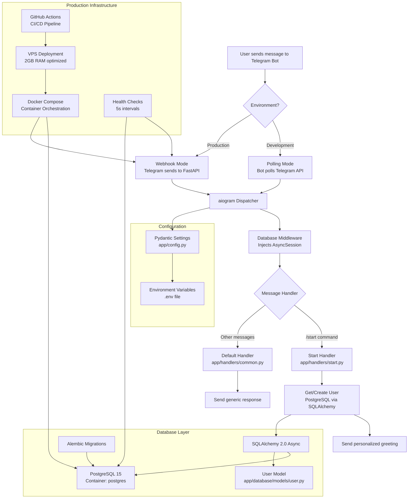

# Technical Architecture

Technical overview of Hello Bot application architecture, dependencies, and implementation details.

## Application Flow



## Project Structure

```
hello-bot/
├── app/                           # Main application code
│   ├── __init__.py
│   ├── main.py                   # Application entry point
│   ├── config.py                 # Pydantic settings management
│   ├── webhook.py                # FastAPI webhook server
│   ├── database/                 # Database layer
│   │   ├── __init__.py
│   │   ├── base.py              # SQLAlchemy Base + TimestampMixin
│   │   ├── session.py           # Async session management
│   │   └── models/              # Database models
│   │       ├── __init__.py
│   │       └── user.py          # User model
│   ├── handlers/                # Message handlers
│   │   ├── __init__.py
│   │   ├── start.py            # /start command handler
│   │   └── common.py           # Default message handler
│   └── middlewares/             # Bot middlewares
│       ├── __init__.py
│       └── database.py         # Database session middleware
├── alembic/                      # Database migrations
│   ├── env.py                   # Alembic configuration
│   ├── script.py.mako          # Migration template
│   └── versions/               # Migration files
├── docs/                        # Documentation
├── scripts/                     # Deployment scripts
│   ├── deploy_production.sh    # Production deployment
│   └── test_vps.sh            # VPS testing
├── .github/workflows/          # CI/CD pipelines
│   └── deploy.yml             # GitHub Actions workflow
├── docker-compose.yml          # Container orchestration
├── Dockerfile                  # Container definition
├── pyproject.toml             # Python dependencies
└── .env.example               # Environment template
```

## Core Components

### 1. Application Entry Point (`app/main.py`)

**Key Features:**
- **Dual Mode Operation**: Polling (dev) vs Webhook (production)
- **Graceful Shutdown**: Signal handling (SIGTERM, SIGINT)
- **Performance Optimization**: uvloop on Linux systems
- **Lifespan Management**: Database initialization and cleanup

**Flow:**
```python
async def main():
    setup_logging()
    async with lifespan():
        bot = create_bot()
        dp = create_dispatcher()
        
        if settings.is_production and settings.webhook_url:
            # Production: FastAPI webhook server
            app = create_webhook_app(bot, dp)
            server = uvicorn.Server(config)
            await server.serve()
        else:
            # Development: Polling mode
            await dp.start_polling(bot)
```

### 2. Configuration Management (`app/config.py`)

**Technology:** Pydantic Settings with environment file support

**Configuration Categories:**
- **Bot Settings**: `bot_token`, Telegram API configuration
- **Database**: `database_url`, connection pooling settings
- **Application**: `environment`, `debug`, `log_level`
- **Webhook**: `webhook_url`, `webhook_secret_token`, server settings

**Environment-Specific Behavior:**
```python
@property
def is_production(self) -> bool:
    return self.environment.lower() == "production"
```

### 3. Database Layer

**Architecture:** SQLAlchemy 2.0 Async + asyncpg

**Components:**
- **Base Model** (`app/database/base.py`): Common functionality
- **Session Management** (`app/database/session.py`): Connection pooling
- **Models** (`app/database/models/`): Data models
- **Migrations** (`alembic/`): Schema versioning

**Session Management:**
```python
engine = create_async_engine(
    settings.database_url,
    pool_size=settings.db_pool_size,     # Default: 5
    max_overflow=settings.db_max_overflow,  # Default: 10
    echo=settings.debug,                 # SQL logging in debug
)
```

### 4. Message Handling

**Framework:** aiogram 3.0+ with async/await

**Handler Structure:**
```python
# Middleware injection
dp.message.middleware(DatabaseMiddleware())

# Handler registration
dp.message.register(start_handler, Command("start"))
dp.message.register(default_handler)  # Catch-all
```

**Database Integration:**
```python
async def start_handler(message: types.Message, session: AsyncSession):
    user = await get_or_create_user(session, message.from_user)
    await message.answer(f"Hello, {user.display_name}")
```

## Dependencies & Libraries

### Core Dependencies

| Package | Version | Purpose | Documentation |
|---------|---------|---------|---------------|
| **aiogram** | >=3.0.0 | Telegram Bot API framework | [docs.aiogram.dev](https://docs.aiogram.dev/) |
| **sqlalchemy** | >=2.0.0 | Async ORM for PostgreSQL | [docs.sqlalchemy.org](https://docs.sqlalchemy.org/) |
| **asyncpg** | >=0.29.0 | PostgreSQL async driver | [magicstack.github.io/asyncpg](https://magicstack.github.io/asyncpg/) |
| **pydantic** | >=2.0.0 | Settings & data validation | [docs.pydantic.dev](https://docs.pydantic.dev/) |
| **fastapi** | >=0.104.0 | Webhook server (production) | [fastapi.tiangolo.com](https://fastapi.tiangolo.com/) |
| **uvicorn** | >=0.24.0 | ASGI server | [uvicorn.org](https://uvicorn.org/) |
| **alembic** | >=1.13.0 | Database migrations | [alembic.sqlalchemy.org](https://alembic.sqlalchemy.org/) |

### Performance Dependencies

| Package | Purpose | Platform |
|---------|---------|----------|
| **uvloop** | Faster async event loop | Linux/macOS only |
| **python-dotenv** | Environment file loading | All platforms |

### Development Dependencies

| Package | Purpose |
|---------|---------|
| **ruff** | Code formatting & linting |
| **pytest** | Testing framework |
| **pytest-asyncio** | Async test support |

## Environment Modes

### Development Mode

**Characteristics:**
- **Polling Mode**: Bot actively polls Telegram API
- **Debug Logging**: SQL queries, detailed logs
- **Hot Reload**: Code changes trigger restart
- **Local Database**: PostgreSQL in Docker container

**Configuration:**
```env
ENVIRONMENT=development
DEBUG=true
LOG_LEVEL=DEBUG
```

**Startup Flow:**
```python
# Development: polling mode
await bot.delete_webhook(drop_pending_updates=True)
await dp.start_polling(bot, handle_signals=False)
```

### Production Mode

**Characteristics:**
- **Webhook Mode**: Telegram sends updates to FastAPI server
- **Optimized Logging**: Reduced verbosity, performance focus
- **Health Checks**: Container health monitoring
- **Resource Limits**: Memory/CPU constraints for 2GB VPS

**Configuration:**
```env
ENVIRONMENT=production
DEBUG=false
LOG_LEVEL=INFO
WEBHOOK_URL=https://your-domain.com/webhook
```

**Startup Flow:**
```python
# Production: webhook mode
await bot.set_webhook(url=settings.webhook_url, secret_token=settings.webhook_secret_token)
app = create_webhook_app(bot, dp)
server = uvicorn.Server(config)
await server.serve()
```

## Performance Optimizations

### 2GB RAM VPS Optimizations

**Database Configuration:**
```yaml
# docker-compose.yml
postgres:
  deploy:
    resources:
      limits:
        memory: 512M
      reservations:
        memory: 256M
```

**Application Configuration:**
```yaml
bot:
  deploy:
    resources:
      limits:
        memory: 256M
      reservations:
        memory: 128M
  environment:
    DB_POOL_SIZE: 3
    DB_MAX_OVERFLOW: 5
    PYTHONOPTIMIZE: "1"
```

**Health Check Optimization:**
```yaml
healthcheck:
  interval: 5s
  timeout: 3s
  retries: 12
  start_period: 10s
```

### Code Optimizations

**Async Event Loop:**
```python
# Use uvloop for better performance on Linux
try:
    import uvloop
    if sys.platform != "win32":
        asyncio.set_event_loop_policy(uvloop.EventLoopPolicy())
except ImportError:
    pass
```

**Database Session Management:**
```python
# Middleware handles session lifecycle
class DatabaseMiddleware(BaseMiddleware):
    async def __call__(self, handler, event, data):
        async with AsyncSessionLocal() as session:
            data["session"] = session
            result = await handler(event, data)
            await session.commit()
            return result
```

## Security Considerations

### Production Security

1. **Webhook Secret Token**: Validates incoming requests
2. **Non-root Containers**: Security-first containerization
3. **Resource Limits**: Prevents resource exhaustion
4. **Environment Isolation**: Settings via environment variables

### Database Security

1. **Connection Pooling**: Controlled database connections
2. **Prepared Statements**: SQLAlchemy prevents SQL injection
3. **Transaction Management**: Automatic rollback on errors

## Deployment Architecture

### Container Architecture

```yaml
services:
  postgres:      # Database server
  migration:     # One-time migration job
  bot:          # Main application
```

### CI/CD Pipeline

1. **Build Stage**: Docker image with optimized caching
2. **Deploy Stage**: SSH to VPS → run deployment script
3. **Health Checks**: Verify successful deployment

### VPS Resource Allocation

| Component | Memory | CPU | Purpose |
|-----------|--------|-----|---------|
| PostgreSQL | 512MB | Shared | Database server |
| Bot App | 256MB | Shared | Telegram bot application |
| System | ~1GB | Shared | OS + Docker overhead |
| **Total** | **~1.8GB** | **2 cores** | **Fits 2GB VPS** |

## Monitoring & Logging

### Log Levels

- **DEBUG**: Development only, SQL queries, detailed flow
- **INFO**: Production default, key events, user interactions
- **WARNING**: Potential issues, deprecated features
- **ERROR**: Failures, exceptions, critical issues

### Health Monitoring

```python
# Health check endpoints
@app.get("/health")
async def health_check():
    return {"status": "ok", "bot": "healthy"}
```

### Performance Metrics

- **Startup Time**: Application initialization duration
- **Response Time**: Message handling latency  
- **Memory Usage**: Container resource consumption
- **Database Performance**: Connection pool utilization