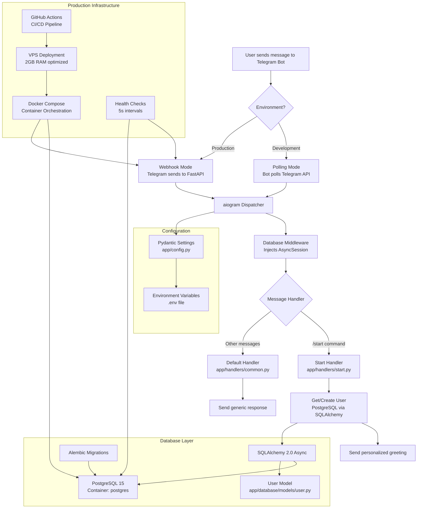

# Technical Architecture

Technical overview of Hello Bot application architecture, dependencies, and implementation details.

## Application Flow



## Project Structure

```
hello-bot/
├── app/                           # Main application code
│   ├── __init__.py
│   ├── main.py                   # Application entry point with structured logging
│   ├── config.py                 # Pydantic settings management
│   ├── webhook.py                # Enhanced FastAPI webhook server
│   ├── logging.py                # Structured logging configuration
│   ├── metrics.py                # Prometheus metrics collection
│   ├── cache.py                  # Redis caching with fallback
│   ├── container.py              # Dependency injection container
│   ├── database/                 # Database layer
│   │   ├── __init__.py
│   │   ├── base.py              # SQLAlchemy Base + TimestampMixin
│   │   ├── session.py           # Async session management
│   │   └── models/              # Database models
│   │       ├── __init__.py
│   │       └── user.py          # User model with composite indexes
│   ├── handlers/                # Modern Router-based handlers
│   │   ├── __init__.py          # Router exports
│   │   ├── start.py            # /start command with Router pattern
│   │   └── common.py           # Default handler with explicit filters
│   ├── services/                # Service layer (business logic)
│   │   ├── __init__.py
│   │   ├── base.py             # BaseService abstract class
│   │   └── user.py             # UserService with caching
│   └── middlewares/             # Bot middlewares
│       ├── __init__.py
│       └── database.py         # Database session middleware
├── alembic/                      # Database migrations
│   ├── env.py                   # Alembic configuration
│   ├── script.py.mako          # Migration template
│   └── versions/               # Migration files
├── docs/                        # Documentation
├── scripts/                     # Deployment scripts
│   ├── deploy_production.sh    # Production deployment
│   └── test_vps.sh            # VPS testing
├── .github/workflows/          # CI/CD pipelines
│   └── deploy.yml             # GitHub Actions workflow
├── docker-compose.yml          # Container orchestration
├── Dockerfile                  # Container definition
├── pyproject.toml             # Python dependencies
└── .env.example               # Environment template
```

## Core Components

### 1. Application Entry Point (`app/main.py`)

**Key Features:**

- **Dual Mode Operation**: Polling (dev) vs Webhook (production)
- **Graceful Shutdown**: Signal handling (SIGTERM, SIGINT)
- **Performance Optimization**: uvloop on Linux systems
- **Lifespan Management**: Database initialization and cleanup

**Flow:**

```python
async def main():
    setup_logging()
    async with lifespan():
        bot = create_bot()
        dp = create_dispatcher()

        if settings.is_production and settings.webhook_url:
            # Production: FastAPI webhook server
            app = create_webhook_app(bot, dp)
            server = uvicorn.Server(config)
            await server.serve()
        else:
            # Development: Polling mode
            await dp.start_polling(bot)
```

### 2. Configuration Management (`app/config.py`)

**Technology:** Pydantic Settings with environment file support

**Configuration Categories:**

- **Project**: `project_name` (required) - Creates unique Docker networks/containers
- **Bot Settings**: `bot_token`, Telegram API configuration
- **Database**: `database_url`, connection pooling settings
- **Application**: `environment`, `debug`, `log_level`
- **Webhook**: `webhook_url`, `webhook_secret_token`, server settings

**Environment-Specific Behavior:**

```python
@property
def is_production(self) -> bool:
    return self.environment.lower() == "production"
```

### 3. Database Layer

**Architecture:** SQLAlchemy 2.0 Async + asyncpg

**Components:**

- **Base Model** (`app/database/base.py`): Common functionality
- **Session Management** (`app/database/session.py`): Connection pooling
- **Models** (`app/database/models/`): Data models
- **Migrations** (`alembic/`): Schema versioning

**Session Management:**

```python
engine = create_async_engine(
    settings.database_url,
    pool_size=settings.db_pool_size,     # Default: 5
    max_overflow=settings.db_max_overflow,  # Default: 10
    echo=settings.debug,                 # SQL logging in debug
)
```

**Critical: AsyncSession Concurrency Safety**

```python
# ❌ NEVER share AsyncSession between concurrent tasks
async def bad_pattern():
    session = AsyncSession(engine)

    # This will cause IllegalStateChangeError and data corruption
    tasks = [
        asyncio.create_task(process_user(session, user_id))
        for user_id in user_ids
    ]
    await asyncio.gather(*tasks)

# ✅ CORRECT: Each task gets its own AsyncSession
async def correct_pattern():
    tasks = []
    for user_id in user_ids:
        # Create new session for each task
        async with AsyncSessionLocal() as session:
            task = asyncio.create_task(process_user(session, user_id))
            tasks.append(task)

    await asyncio.gather(*tasks)
```

### 4. Message Handling

**Framework:** aiogram 3.0+ with async/await

**Current Production Architecture:**

```python
# Modern Router pattern with Service Layer and Dependency Injection
from aiogram import Router
from app.services.user import UserService

# Create router for start commands
start_router = Router(name="start")

@start_router.message(Command("start"))
async def start_handler(message: types.Message, user_service: UserService):
    """Handler with automatic service injection."""
    user = await user_service.get_or_create_user(message.from_user)
    await message.answer(f"Hello, {user.display_name}")

# Include router in dispatcher with DI
dp.include_router(start_router)

# Service layer handles business logic
class UserService(BaseService):
    async def get_or_create_user(self, telegram_user: types.User) -> User:
        # Redis caching + database operations
        cached_user = await self.cache.get_user(telegram_user.id)
        if cached_user:
            return cached_user

        # Database query with optimized indexes
        user = await self._get_or_create_from_db(telegram_user)
        await self.cache.set_user(user)
        return user
```

**Legacy Handler Registration:**

```python
# Alternative: Direct registration (used in Hello Bot)
dp.message.register(start_handler, Command("start"))
dp.message.register(default_handler)  # Catch-all
```

**Database Integration:**

```python
async def start_handler(message: types.Message, session: AsyncSession):
    user = await get_or_create_user(session, message.from_user)
    await message.answer(f"Hello, {user.display_name}")
```

**Dependency Injection via Type Hints:**

```python
# aiogram 3.0+ automatically injects dependencies based on type hints
async def handler(message: types.Message, session: AsyncSession, bot: Bot):
    # session injected by DatabaseMiddleware
    # bot injected automatically by aiogram
    pass

# Custom dependency injection
@dp.message.middleware()
async def custom_dependency_middleware(handler, event, data):
    data["custom_service"] = MyService()
    return await handler(event, data)

async def handler_with_custom_dep(message: types.Message, custom_service: MyService):
    result = custom_service.process()
    await message.answer(result)
```

## Dependencies & Libraries

### Core Dependencies

| Package        | Version   | Purpose                     | Documentation                                                         |
| -------------- | --------- | --------------------------- | --------------------------------------------------------------------- |
| **aiogram**    | >=3.0.0   | Telegram Bot API framework  | [docs.aiogram.dev](https://docs.aiogram.dev/)                         |
| **sqlalchemy** | >=2.0.0   | Async ORM for PostgreSQL    | [docs.sqlalchemy.org](https://docs.sqlalchemy.org/)                   |
| **asyncpg**    | >=0.29.0  | PostgreSQL async driver     | [magicstack.github.io/asyncpg](https://magicstack.github.io/asyncpg/) |
| **pydantic**   | >=2.0.0   | Settings & data validation  | [docs.pydantic.dev](https://docs.pydantic.dev/)                       |
| **fastapi**    | >=0.104.0 | Webhook server (production) | [fastapi.tiangolo.com](https://fastapi.tiangolo.com/)                 |
| **uvicorn**    | >=0.24.0  | ASGI server                 | [uvicorn.org](https://uvicorn.org/)                                   |
| **alembic**    | >=1.13.0  | Database migrations         | [alembic.sqlalchemy.org](https://alembic.sqlalchemy.org/)             |

### Performance Dependencies

| Package           | Purpose                  | Platform         |
| ----------------- | ------------------------ | ---------------- |
| **uvloop**        | Faster async event loop  | Linux/macOS only |
| **python-dotenv** | Environment file loading | All platforms    |

### Development Dependencies

| Package            | Purpose                       |
| ------------------ | ----------------------------- |
| **ruff**           | Code formatting & linting     |
| **pytest**         | Testing framework             |
| **pytest-asyncio** | Async test support            |
| **aiosqlite**      | SQLite async driver for tests |

### Modern Architecture Dependencies

| Package               | Version  | Purpose                     |
| --------------------- | -------- | --------------------------- |
| **structlog**         | >=23.2.0 | Structured JSON logging     |
| **redis**             | >=5.0.0  | Redis caching with fallback |
| **prometheus-client** | >=0.19.0 | Metrics collection          |
| **slowapi**           | >=0.1.9  | Rate limiting for FastAPI   |
| **psutil**            | >=5.9.0  | System resource monitoring  |

## Service Layer Architecture

### Overview

The bot uses a clean Service Layer pattern that separates business logic from handlers:

**Architecture Layers:**

```
📱 Telegram API
     ↓
🤖 aiogram Handlers (presentation layer)
     ↓ Dependency Injection
🏢 Service Layer (business logic)
     ↓ Session management
🗄️ Database Layer (SQLAlchemy models)
     ↓ Connection pooling
🐘 PostgreSQL Database
```

### Service Layer Implementation

```python
# app/services/base.py
from abc import ABC, abstractmethod
from sqlalchemy.ext.asyncio import AsyncSession

class BaseService(ABC):
    """Abstract base service with common functionality."""

    def __init__(self, session: AsyncSession, cache: Cache | None = None):
        self.session = session
        self.cache = cache or get_default_cache()

    async def commit(self) -> None:
        """Commit database transaction."""
        await self.session.commit()

    async def rollback(self) -> None:
        """Rollback database transaction."""
        await self.session.rollback()

# app/services/user.py
class UserService(BaseService):
    """Service for user-related business logic with caching."""

    async def get_or_create_user(self, telegram_user: types.User) -> User:
        """Get user with Redis caching and database fallback."""
        # 1. Try cache first (Redis/memory)
        cached_user = await self.cache.get_user(telegram_user.id)
        if cached_user:
            logger.debug("User cache hit", telegram_id=telegram_user.id)
            return cached_user

        # 2. Database query with optimized index
        stmt = select(User).where(User.telegram_id == telegram_user.id)
        user = (await self.session.execute(stmt)).scalar_one_or_none()

        if user:
            # Update existing user
            await self._update_user_info(user, telegram_user)
        else:
            # Create new user
            user = await self._create_new_user(telegram_user)

        # 3. Cache the result
        await self.cache.set_user(user)
        return user
```

### Dependency Injection System

Simple DI container without external dependencies:

```python
# app/container.py
from typing import TypeVar, Type, Dict, Any

ServiceType = TypeVar('ServiceType')

class ServiceProvider:
    """Simple dependency injection container."""

    def __init__(self):
        self._services: Dict[Type, Any] = {}

    def register(self, interface: Type[ServiceType], implementation: ServiceType):
        """Register service implementation."""
        self._services[interface] = implementation

    def get(self, interface: Type[ServiceType]) -> ServiceType:
        """Get service instance."""
        return self._services[interface]

# Usage in handlers
@inject_services
async def start_handler(message: types.Message, user_service: UserService) -> None:
    """Handler with automatic service injection."""
    user = await user_service.get_or_create_user(message.from_user)
    await message.answer(f"Hello, {user.display_name}")
```

## Caching & Performance

### Redis Caching with Fallback

The bot implements intelligent caching with Redis primary and memory fallback:

```python
# app/cache.py
class CacheManager:
    """Redis cache with memory fallback for high availability."""

    def __init__(self):
        self.redis_client = None
        self.memory_cache = {}  # Fallback cache

    async def get_user(self, telegram_id: int) -> User | None:
        """Get user from cache with fallback."""
        try:
            # Try Redis first
            if self.redis_client:
                data = await self.redis_client.get(f"user:{telegram_id}")
                if data:
                    return User.model_validate_json(data)
        except Exception:
            logger.warning("Redis cache miss, using memory fallback")

        # Fallback to memory cache
        return self.memory_cache.get(f"user:{telegram_id}")

    async def set_user(self, user: User, ttl: int = 3600) -> None:
        """Cache user in Redis and memory."""
        user_data = user.model_dump_json()

        # Store in both Redis and memory
        try:
            if self.redis_client:
                await self.redis_client.setex(
                    f"user:{user.telegram_id}",
                    ttl,
                    user_data
                )
        except Exception:
            pass  # Redis failure is non-critical

        # Always store in memory as fallback
        self.memory_cache[f"user:{user.telegram_id}"] = user
```

### Monitoring & Observability

**Structured Logging:**

```python
# app/logging.py - Production JSON logging
import structlog

def setup_production_logging():
    """Configure structured logging for production."""
    structlog.configure(
        processors=[
            structlog.stdlib.filter_by_level,
            structlog.stdlib.add_logger_name,
            structlog.stdlib.add_log_level,
            structlog.processors.TimeStamper(fmt="iso"),
            structlog.processors.JSONRenderer(),  # JSON format for production
        ],
        wrapper_class=structlog.stdlib.BoundLogger,
        logger_factory=structlog.stdlib.LoggerFactory(),
        cache_logger_on_first_use=True,
    )

# Usage in services
logger = structlog.get_logger()
logger.info("User created", telegram_id=user.telegram_id, username=user.username)
```

**Prometheus Metrics:**

```python
# app/metrics.py
from prometheus_client import Counter, Histogram, Gauge

# Bot performance metrics
COMMANDS_TOTAL = Counter('bot_commands_total', 'Total commands', ['command'])
RESPONSE_TIME = Histogram('bot_response_seconds', 'Response time')
USERS_ACTIVE = Gauge('bot_users_active', 'Active users count')
CACHE_HITS = Counter('bot_cache_hits_total', 'Cache hits', ['cache_type'])

# Usage in handlers
@RESPONSE_TIME.time()
async def start_handler(message: types.Message, user_service: UserService):
    COMMANDS_TOTAL.labels(command='start').inc()
    # handler logic

# Metrics endpoint
@app.get("/metrics")
async def metrics():
    return Response(generate_latest(), media_type="text/plain")
```

**Enhanced Health Checks:**

```python
# Comprehensive health monitoring
@app.get("/health")
async def health_check():
    checks = {
        "database": await _check_database(),
        "redis": await _check_redis(),
        "bot_api": await _check_bot_api(),
        "memory_usage": _get_memory_usage(),
    }

    overall_status = "healthy" if all(
        check == "healthy" for check in checks.values()
        if isinstance(check, str)
    ) else "unhealthy"

    return {"status": overall_status, "checks": checks}
```

## Environment Modes

### Development Mode

**Characteristics:**

- **Polling Mode**: Bot actively polls Telegram API
- **Debug Logging**: SQL queries, detailed logs
- **Hot Reload**: Code changes trigger restart
- **Local Database**: PostgreSQL in Docker container

**Configuration:**

```env
PROJECT_NAME=telegram-bot  # Required: unique project identifier
ENVIRONMENT=development
DEBUG=true
LOG_LEVEL=DEBUG
```

**Startup Flow:**

```python
# Development: polling mode
await bot.delete_webhook(drop_pending_updates=True)
await dp.start_polling(bot, handle_signals=False)
```

### Production Mode

**Characteristics:**

- **Webhook Mode**: Telegram sends updates to FastAPI server
- **Optimized Logging**: Reduced verbosity, performance focus
- **Health Checks**: Container health monitoring
- **Resource Limits**: Memory/CPU constraints for 2GB VPS

**Configuration:**

```env
PROJECT_NAME=hello-bot  # Required: must match GitHub Secrets
ENVIRONMENT=production
DEBUG=false
LOG_LEVEL=INFO
WEBHOOK_URL=https://your-domain.com/webhook
```

**Startup Flow:**

```python
# Production: webhook mode
await bot.set_webhook(url=settings.webhook_url, secret_token=settings.webhook_secret_token)
app = create_webhook_app(bot, dp)
server = uvicorn.Server(config)
await server.serve()
```

## Performance Optimizations

### 2GB RAM VPS Optimizations

**Database Configuration:**

```yaml
# docker-compose.yml
postgres:
  deploy:
    resources:
      limits:
        memory: 512M
      reservations:
        memory: 256M
```

**Application Configuration:**

```yaml
bot:
  deploy:
    resources:
      limits:
        memory: 256M
      reservations:
        memory: 128M
  environment:
    DB_POOL_SIZE: 3
    DB_MAX_OVERFLOW: 5
    PYTHONOPTIMIZE: "1"
```

**Health Check Optimization:**

```yaml
healthcheck:
  interval: 5s
  timeout: 3s
  retries: 12
  start_period: 10s
```

### Code Optimizations

**Async Event Loop:**

```python
# Use uvloop for better performance on Linux
try:
    import uvloop
    if sys.platform != "win32":
        asyncio.set_event_loop_policy(uvloop.EventLoopPolicy())
except ImportError:
    pass
```

**Database Session Management:**

```python
# Middleware handles session lifecycle
class DatabaseMiddleware(BaseMiddleware):
    async def __call__(self, handler, event, data):
        async with AsyncSessionLocal() as session:
            data["session"] = session
            result = await handler(event, data)
            await session.commit()
            return result
```

## Security Considerations

### Production Security

1. **Webhook Secret Token**: Validates incoming requests
2. **Non-root Containers**: Security-first containerization
3. **Resource Limits**: Prevents resource exhaustion
4. **Environment Isolation**: Settings via environment variables

### Database Security

1. **Connection Pooling**: Controlled database connections
2. **Prepared Statements**: SQLAlchemy prevents SQL injection
3. **Transaction Management**: Automatic rollback on errors

## Deployment Architecture

### Container Architecture

```yaml
services:
  postgres: # Database server
    container_name: ${PROJECT_NAME}_postgres
    networks: [bot_network]

  migration: # One-time migration job
    container_name: ${PROJECT_NAME}_migration
    networks: [bot_network]

  bot: # Main application
    container_name: ${PROJECT_NAME}_app
    networks: [bot_network]

networks:
  bot_network:
    name: ${PROJECT_NAME}_network # Creates unique network per project
    driver: bridge
```

**Network Architecture:**

- **Isolated Networks**: Each project gets unique network via `PROJECT_NAME`
- **Service Communication**: All containers on same private network
- **External Access**: Only bot container exposes ports (8000 for webhook)
- **Security**: Database isolated from external access

### Modern aiogram 3.0+ Features Used

**Router System:**

- Modular handler organization
- Better code separation and maintainability
- Simplified testing and debugging

**Enhanced Dependency Injection:**

- Type-hint based automatic injection
- Custom dependency providers via middleware
- Cleaner handler signatures

**Advanced Filters:**

- Built-in filter combinations with `F` object
- Custom filter classes for complex logic
- Composable filter expressions

**Session Management:**

- Proper AsyncSession-per-task pattern
- Connection pooling optimization
- Graceful error handling and rollbacks

### CI/CD Pipeline

1. **Build Stage**: Docker image with optimized caching
2. **Deploy Stage**: SSH to VPS → run deployment script
3. **Health Checks**: Verify successful deployment

### VPS Resource Allocation

| Component  | Memory     | CPU         | Purpose                  |
| ---------- | ---------- | ----------- | ------------------------ |
| PostgreSQL | 512MB      | Shared      | Database server          |
| Bot App    | 256MB      | Shared      | Telegram bot application |
| System     | ~1GB       | Shared      | OS + Docker overhead     |
| **Total**  | **~1.8GB** | **2 cores** | **Fits 2GB VPS**         |

## Monitoring & Logging

### Log Levels

- **DEBUG**: Development only, SQL queries, detailed flow
- **INFO**: Production default, key events, user interactions
- **WARNING**: Potential issues, deprecated features
- **ERROR**: Failures, exceptions, critical issues

### Health Monitoring

```python
# Health check endpoints
@app.get("/health")
async def health_check():
    return {"status": "ok", "bot": "healthy"}
```

### Performance Metrics

- **Startup Time**: Application initialization duration
- **Response Time**: Message handling latency
- **Memory Usage**: Container resource consumption
- **Database Performance**: Connection pool utilization
